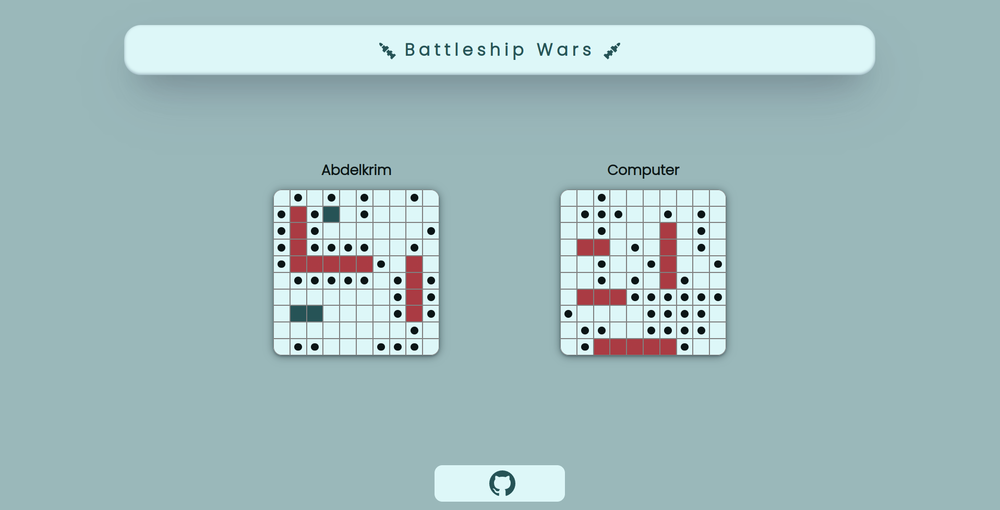

	<h1>Battleship Game 
	 
		
		
		
		
        
		 
	</h1>
	<h3> 👇 Play It Yourself 👇 </h3>

## 📝 Description
My take on building the famous battleship game. 
-I made this app to practice jest testing. 
-I also learned a lot of programming concepts on the way.

## 🛠️ Built with
 * HTML5.
 * CSS.
 * Vanilla JavaScript.
 * Webpack.
 * Jest.